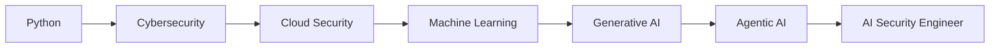

<h1 align="center">⚡ SHUBHAM KUMAR PANDEY ⚡</h1>

<h3 align="center">
Artificial Intelligence • Cybersecurity • Cloud Security
</h3>

---

```python
class ShubhamPandey:

    def __init__(self):
        self.role = "AI & Cybersecurity Student"
        self.location = "India"
        self.current_focus = [
            "Generative AI",
            "Agentic AI",
            "Cybersecurity",
            "Cloud Security",
            "Automation"
        ]

        self.skills = {
            "Languages": ["Python", "Linux Scripting"],
            "Cyber": [
                "Reconnaissance",
                "Enumeration",
                "Ethical Hacking",
                "Red Teaming"
            ],
            "Cloud": [
                "AWS IAM",
                "Cloud Security"
            ],
            "AI": [
                "Machine Learning",
                "Generative AI"
            ]
        }

    def life_goal(self):
        return "Build Intelligent Systems That Defend Themselves"

me = ShubhamPandey()

while True:
    me.learn()
    me.build()
    me.break()
    me.secure()
```

---

# ⚔️ CURRENT MISSION

```yaml
Status:
  Learning: AI + Cybersecurity
  Building: Security Automation Tools
  Exploring: Agentic AI Systems
  Goal: AI Security Engineer

Power_Level: Increasing...
```

---

# 🧠 TECH STACK

### Languages


### Cybersecurity

```text
Reconnaissance
Enumeration
Vulnerability Assessment
Ethical Hacking
Red Teaming Foundations
```

### Cloud

```text
AWS IAM
Cloud Security
Identity Management
```

### AI

```text
Machine Learning
Generative AI
Prompt Engineering
Agentic AI
```

---

# 🚀 ACTIVE PROJECTS

```bash
> Python Security Automation Scripts

Status : ACTIVE
Type   : Cybersecurity

--------------------------------

> AI Security Experiments

Status : ACTIVE
Type   : Artificial Intelligence

--------------------------------

> Cloud Security Labs

Status : ACTIVE
Type   : Cloud Security
```

---

# 📈 GITHUB ANALYTICS

<p align="center">


</p>

---

# 🏆 ACHIEVEMENTS

```text
✓ Certified Multi-Cloud Red Team Analyst
✓ Foundations of Cybersecurity
✓ Programming with Generative AI
✓ Python Programming
✓ Ethical Hacking
```

---

# 🌌 FUTURE ROADMAP



---

# 💀 DIGITAL PHILOSOPHY

> "The future belongs to those who can build intelligent systems and secure them."

---

<p align="center">

⚡ AI × CYBERSECURITY × CLOUD ⚡

</p>[▶] LLM Security Research
[▶] AI-Powered Security Systems

🧠 Engineering Philosophy
Understand the system.
Break the system.
Secure the system.
Repeat.


